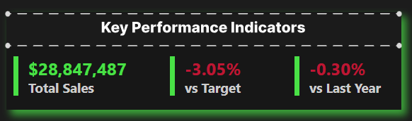
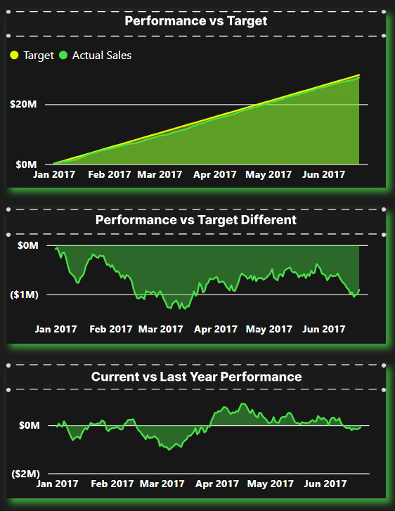
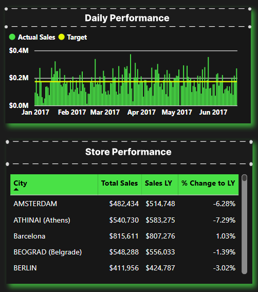

# Summit Global Inc. Regional Sales Performance Tracker: A Power BI Case Study

<p align="center">
  <a href="https://tinyurl.com/53chuyna" target="_blank">
    
  </a>
</p>

This repository contains a Regional Performance Command Center built in Power BI for "Summit Global Inc.," a fictional multinational corporation. The dashboard is designed for sales leadership to provide an immediate, contextualized view of performance against sales targets and historical data. It moves beyond static reports to enable real-time diagnosis of regional performance and data-driven decision-making.


## Table of Contents
- [1. Case Study Overview](#1-case-study-overview)
  - [The Business Problem: Lack of Contextual Insight](#the-business-problem-lack-of-contextual-insight)
  - [The Solution: A Regional Command Center](#the-solution-a-regional-command-center)
  - [Tech Stack](#tech-stack)
- [2. The Analytical Approach: A Dashboard Deep Dive](#2-the-analytical-approach-a-dashboard-deep-dive)
  - [1. The 10-Second Health Check: The KPI Card](#1-the-10-second-health-check-the-kpi-card)
  - [2. The Strategic "Race" Against Goals: Cumulative Trends](#2-the-strategic-race-against-goals-cumulative-trends)
  - [3. The Daily Pulse & Granular Breakdown](#3-the-daily-pulse--granular-breakdown)
- [3. Repository Structure](#3-repository-structure)
- [4. How to Explore This Project](#4-how-to-explore-this-project)

---

## 1. Case Study Overview

### The Business Problem: Lack of Contextual Insight
The Head of European Sales at Summit Global Inc. was facing a classic leadership challenge: sales data was available, but it lacked immediate context. Static reports would show a country's sales number, but couldn't instantly answer the most critical follow-up questions:
*   Is this number good or bad? How does it compare to our goal?
*   Are we growing compared to last year, even if we are missing our ambitious new target?
*   Which specific cities within a lagging country are the root cause of the problem?
Answering these questions required manual data pulls and analysis, causing a delay between data and decision.

### The Solution: A Regional Command Center
This Power BI dashboard was built to be a "single pane of glass" for regional performance. It provides real-time, interactive analysis, allowing leaders to filter by region and instantly see performance in the three most important contexts: versus Target, versus Last Year, and versus the Daily Goal.

### Tech Stack
*   **Analysis & Visualization:** Power BI Desktop & Power BI Service
*   **Modeling & Calculations:** DAX
*   **Data Transformation (ETL):** Power Query

---

## 2. The Analytical Approach: A Dashboard Deep Dive

The dashboard is designed for top-down analysis, guiding a leader from a high-level summary down to the specific drivers of performance.

### 1. The 10-Second Health Check: The KPI Card
The journey begins with the main KPI card, which provides an instant summary of overall performance for the selected scope.

<p align="center">  </p>

*   **`Total Sales`:** The absolute revenue number.
*   **`vs Target`:** The most important metric—the percentage difference between current sales and the target.
*   **`vs Last Year`:** The crucial historical context—the growth or decline compared to the previous year.

### 2. The Strategic "Race" Against Goals: Cumulative Trends
The three area charts provide a rich, historical narrative of performance throughout the selected time frame.

<p align="center">  </p>

*   **`Performance vs Target`:** This chart visualizes the "race" against the goal, showing `Actual Sales` (green area) tracking against the `Target` (yellow line).
*   **`Performance vs Target Different`:** This chart **isolates the gap** from the chart above, making the dollar amount of the deficit or surplus tangible and easy to track over time.
*   **`Current vs Last Year Performance`:** This chart visualizes the performance gap compared to the previous year, providing critical context. A team might be behind an ambitious target but still show strong year-over-year growth.

### 3. The Daily Pulse & Granular Breakdown
The final section allows a manager to diagnose the consistency of performance and pinpoint specific problem areas.

<p align="center">  </p>

*   **`Daily Performance`:** This chart compares daily sales against the daily allocated target. It helps answer, "Are we performing consistently, or are we relying on a few great days to save the month?"
*   **`Store Performance`:** After identifying a trend at the regional level (using the interactive map), this table provides the final layer of detail, showing city-level performance and year-over-year growth to identify exactly where action is needed.

**For a complete breakdown of the target-setting logic and all DAX formulas, please see the `docs/` folder.**

---

## 3. Repository Structure
```
.
├── assets/
│   └── cumulative_charts.png
│   └── daily_chart_and_table.png
│   └── data_model.png
│   └── kpi_card.png
│   └── regional_performance_demo.gif
├── docs/
│   ├── 01_Business_Context.md
│   ├── 02_Analytical_Approach.md
│   └── 03_Data_Model_and_DAX.md
└── README.md
```

---

## 4. How to Explore This Project
1.  **Interact with the Live Dashboard:**
    *   Click the "Live Dashboard" badge at the top of this page or go directly to: [Live Tracker Demo](https://tinyurl.com/53chuyna)
2.  **Review the Documentation:**
    *   For a deeper understanding of the business logic and technical implementation, review the detailed markdown files in the `docs/` folder.
