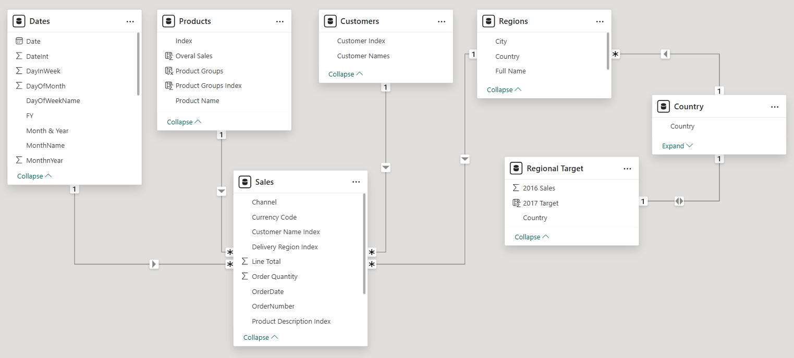

# 3. DAX Implementation: The Performance Engine

This document details the complete technical foundation of the Regional Performance Tracker, including the data model structure and an exhaustive dictionary of all DAX calculations.

## Data Model

The project is built on a standard Star Schema. Note the `Regional Target` table, which is a calculated table used to store the target values, connecting to the rest of the model through the `Regions` table.



### Table Descriptions

| Table             | Type      | Description                                                                                             |
|-------------------|-----------|---------------------------------------------------------------------------------------------------------|
| **Sales**         | Fact      | Contains the granular transactional data, with each row representing a unique order line item.           |
| **Dates**         | Dimension | A standard calendar table for all time-intelligence calculations.                                       |
| **Products**      | Dimension | A unique list of all products sold.                                                                     |
| **Regions**       | Dimension | Contains geographic data for sales locations (City, Country). It links to the Target table.         |
| **Customers**     | Dimension | A unique list of all customers.                                                                         |
| **Regional Target**| Calculated| A table generated by DAX to calculate and store the 2016 sales and 2017 target for each country.      |
| **Country**       | Dimension | A supplementary table for regional information, likely for map visuals.                                 |

---

## The Complete DAX Dictionary

The following sections detail all DAX logic, structured by function.

### Part 1: Core Measures & Target Calculation

**`Total Sales`**
*   **Purpose:** The foundational measure. Calculates total revenue from the sales data.
*   **DAX Code:**
    ```dax
    Total Sales =
    SUMX(
        Sales,
        Sales[Order Quantity] * Sales[Unit Price]
    )
    ```

**`Regional Target` (Calculated Table)**
*   **Purpose:** This DAX expression creates a physical table in the model. It calculates the total 2016 sales for each country, which serves as the baseline for setting the target.
*   **DAX Code:**
    ```dax
    Regional Target =
    ADDCOLUMNS(
        VALUES(Regions[Country]),
        "2016 Sales",
            CALCULATE(
                [Total Sales],
                FILTER(
                    Dates,
                    Dates[Year] = "2016"
                )
            )
    )
    ```

**`2017 Target` (Calculated Column)**
*   **Purpose:** Calculates the final annual target for each region by applying a 5% uplift to the 2016 sales baseline.
*   **DAX Code:**
    ```dax
    2017 Target = 'Regional Target'[2016 Sales] * 1.05
    ```

**`Total Targets`**
*   **Purpose:** Aggregates the target values from the `Regional Target` table.
*   **DAX Code:**
    ```dax
    Total Targets =
    SUMX(
        'Regional Target',
        'Regional Target'[2017 Target]
    )
    ```

### Part 2: Target Allocation & Time Intelligence

**`Days in Date Context`**
*   **Purpose:** A utility measure to count the number of days visible in the current filter context (e.g., a month, a quarter).
*   **DAX Code:**
    ```dax
    Days in Date Context = COUNTROWS(Dates)
    ```

**`Target Allocations`**
*   **Purpose:** The core logic for daily tracking. It prorates the total target evenly across the selected time period.
*   **DAX Code:**
    ```dax
    Target Allocations = [Total Targets] * ([Days in Date Context] / [Days in Year])
    ```
    *(Note: Assumes a `[Days in Year]` measure like `COUNTROWS(VALUES(Dates[Year]))` exists)*

**`Sales LY`**
*   **Purpose:** A standard time-intelligence measure to calculate sales from the same month in the prior year.
*   **DAX Code:**
    ```dax
    Sales LY =
    CALCULATE(
        [Total Sales],
        DATEADD(
            Dates[Date],
            -1,
            MONTH
        )
    )
    ```

### Part 3: Cumulative & Difference Calculations

**`Cumulative Sales`, `Cumulative Target`, & `Cumulative Sales LY`**
*   **Purpose:** These measures calculate the running totals used in the area charts, providing a view of performance accumulation over time.
*   **DAX Pattern:** They all use the standard and robust `CALCULATE(..., FILTER(ALLSELECTED(...)))` pattern.
*   **DAX Code Examples:**
    ```dax
    Cumulative Target =
    CALCULATE(
        [Target Allocations],
        FILTER(
            ALLSELECTED(Dates),
            Dates[Date] <= MAX(Dates[Date])
        )
    )

    Cumulative Sales =
    CALCULATE(
        [Total Sales],
        FILTER(
            ALLSELECTED(Dates[Date]),
            Dates[Date] <= MAX(Dates[Date])
        )
    )

    Cumulative Sales LY =
    CALCULATE(
        [Sales LY],
        FILTER(
            ALLSELECTED(Dates[Date]),
            Dates[Date] <= MAX(Dates[Date])
        )
    )
    ```

**`Target vs Sales Diff` & `Current vs LY Sales Diff`**
*   **Purpose:** These measures calculate the absolute dollar difference between the cumulative values, which directly feeds the "difference" area charts.
*   **DAX Code:**
    ```dax
    Target vs Sales Diff = [Cumulative Sales] - [Cumulative Target]

    Current vs LY Sales Diff = [Cumulative Sales] - [Cumulative Sales LY]
    ```

### Part 4: Final KPI Percentage Measures

**`% Target-Sales Diff to Target`**
*   **Purpose:** Calculates the percentage by which the sales are over or under the allocated target. Feeds the main KPI card.
*   **DAX Code:**
    ```dax
    % Target-Sales Diff to Target =
    DIVIDE(
        [Target vs Sales Diff],
        [Target Allocations]
    )
    ```

**`% Current-LY Sales Diff`**
*   **Purpose:** Calculates the year-over-year sales growth percentage. Feeds the main KPI card.
*   **DAX Code:**
    ```dax
    % Current-LY Sales Diff =
    DIVIDE(
        [Current vs LY Sales Diff],
        [Cumulative Sales LY]
    )
    ```
```